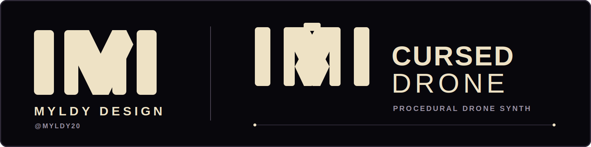

<p align="center">
  
</p>

<p align="center">
  <a href="https://github.com/myldy20/cursed-drone/actions/workflows/build.yml"></a>
  
  
  
</p>

<p align="center">
  <strong>English</strong> · <a href="#русский">Русский</a>
</p>

# Cursed Drone

**Cursed Drone** is a native procedural drone and soundscape instrument for small Linux handhelds. It generates continuous beds, mechanical movement, environmental events and controllable sonic disasters without samples, a tracker grid or conventional note programming.

> **Hardware status:** real-device testing has only been completed on a **TrimUI Brick running Knulli**. The PortMaster package is built for AArch64 and may work on other compatible handhelds, but those devices are currently **unverified**.

## Install

- **[Detailed installation guide — English](docs/install.en.md)**
- **[Подробная инструкция по установке — Русский](docs/install.ru.md)**

### TrimUI Brick quick install

1. Download the latest `cursed-drone-portmaster-aarch64` artifact from the latest successful [GitHub Actions build](https://github.com/myldy20/cursed-drone/actions/workflows/build.yml).
2. GitHub wraps artifacts in an outer ZIP. Open it and locate the inner `curseddrone-aarch64-test.zip` package.
3. Extract the inner package into:

```text
/userdata/roms/ports/
```

The final layout must contain:

```text
/userdata/roms/ports/Cursed Drone.sh
/userdata/roms/ports/curseddrone/cursed-drone-sdl.aarch64
/userdata/roms/ports/curseddrone/assets/cursed-drone-splash.bmp
```

4. Refresh the game list or reboot, then open **Ports → Cursed Drone**.
5. On the first launch, press **Start** after the hardware probe.

To save and exit: **hold Start, then press Select**.

## What it does

A landscape contains four procedural actors with different roles: a continuous bed, movement, a foreground gesture and a distant or textural layer.

```text
actor / engine -> FX 1 -> FX 2 -> FX 3 -> FX 4 -> level / pan
       ^           ^       ^       ^       ^
                  four modulation lanes

four actors -> mixer -> DC blocker -> soft limiter -> master / fade -> SDL audio
```

Current public-test features:

- four simultaneous audio slots;
- ten landscape recipes, including bass-first `Bunker`, `Power Grid`, `Deep Water` and `Ash Field`;
- thirty-two selectable engines, including `Sub Drone`, `Tape Drone`, `Bowed Metal` and `Earth Rumble`;
- four serial FX slots per actor with **basic** processors and **compound** drone/ambient recipes;
- basic FX: drive, low/high-pass, tremolo, delay, crusher, wavefolder, ring modulation, comb, chorus, flanger, phaser, diffuser and AHDR;
- compound FX: `Tape Void`, `Black Hole`, `Ritual Gate`, `Rust Cloud` and `Deep Sea`;
- performance macros for `Material`, `Activity`, `Tension`, `Distance` and `Evolution`;
- separate fade-in and fade-out times, tail-preserving mute and hard `Kill`;
- per-slot and master waveform, RMS, peak and throttled DSP telemetry;
- readable `.cdrone` sessions with debounced autosave;
- English and Russian UI;
- logical `512×384` UI, scaling exactly to the Brick's `1024×768` screen;
- no recorded samples.

## Handheld controls

| Action | TrimUI Brick / handheld |
| --- | --- |
| select track, slot or FX column | D-pad Left / Right |
| select parameter or FX row | D-pad Up / Down |
| change value | L / R |
| choose landscape, engine or effect | Start |
| confirm / cancel picker | B / A |
| next page | X |
| mute selected track | B outside a picker |
| hard Kill | A outside a picker |
| next source track on FX page | Y |
| output auto-fade | Select |
| save and exit | hold Start, then press Select |

A short L/R press changes most values by one percent. Holding accelerates after 1.05 seconds and again after 2.2 seconds.

## Runtime data and logs

The PortMaster package stores everything under:

```text
<ports>/curseddrone/conf/
```

Important files:

```text
autosave.cdrone       current autosave
device-probe.log      first-launch hardware report
cursed-drone.log      application output and startup errors
probe-v1.complete     marker that skips the first-launch probe
```

The verified TrimUI Brick probe reported Mali/OpenGL ES 2 rendering, ALSA audio at 48 kHz stereo with a 512-sample buffer, and a correctly detected `TRIMUI Brick Controller`.

## Landscapes

| Landscape | Character |
| --- | --- |
| `Derelict` | low room pressure, footsteps, door friction and pipe resonance |
| `Factory` | motors, machinery, tape mass and restrained metal |
| `Wasteland` | low wind, sparse insects and isolated signals |
| `Wet Cave` | ground pressure, physical drips, low water and stone impacts |
| `Metro Car` | traction, rail joints, braking and carriage vibration |
| `Broken Nursery` | tape bed, quiet music box, gears and rare lullaby fragments |
| `Bunker` | enclosed sub pressure and distant machinery |
| `Power Grid` | transformer-like mass, motors, bowed metal and ground rumble |
| `Deep Water` | very low pressure, submerged motion and minimal high-frequency detail |
| `Ash Field` | wide low drone, dry wind and distant signals |

## Build and test

The core needs C++20 and CMake 3.16+. SDL2 is required for the interactive frontend.

```bash
cmake -S . -B build -DCMAKE_BUILD_TYPE=Release
cmake --build build -j2
ctest --test-dir build --output-on-failure
./build/cursed-drone-sdl
```

The CI builds and tests Linux, macOS and Ubuntu 20.04 AArch64/PortMaster packages, and renders all ten soundscapes.

## Documentation

- [Installation — English](docs/install.en.md) · [Установка — Русский](docs/install.ru.md)
- [Architecture](docs/architecture.en.md) · [Архитектура](docs/architecture.ru.md)
- [Synthesis catalogue](docs/synthesis-catalog.en.md) · [Каталог синтеза](docs/synthesis-catalog.ru.md)
- [Procedural soundscapes](docs/soundscapes.en.md) · [Процедурные ландшафты](docs/soundscapes.ru.md)
- [Roadmap](docs/roadmap.en.md) · [Дорожная карта](docs/roadmap.ru.md)
- [TrimUI Brick and porting](docs/trimui-brick.en.md) · [TrimUI Brick и портирование](docs/trimui-brick.ru.md)
- [Effect architecture and recipes](docs/effects.en.md) · [Архитектура эффектов и рецепты](docs/effects.ru.md)
- [Third-party notices](THIRD_PARTY_NOTICES.md)

## Credits and licence

Developed by **Myldy design** — [@myldy20](https://github.com/myldy20).

Project code is licensed under **GNU GPL v3.0 or later**. Third-party components retain their own licences; see [LICENSE](LICENSE) and [THIRD_PARTY_NOTICES.md](THIRD_PARTY_NOTICES.md).

---

# Русский

**Проклятый гудёж** — нативный процедурный дрон-синтезатор и генератор звуковых ландшафтов для небольших Linux-консолей. Он создаёт непрерывные фоны, механическое движение, события среды и управляемые звуковые катастрофы без семплов, трекерной сетки и обычного программирования нот.

> **Статус железа:** реальная проверка выполнена только на **TrimUI Brick с Knulli**. PortMaster-пакет собирается под AArch64 и может заработать на других совместимых консолях, но они пока **не проверены**.

## Установка

- **[Подробная инструкция на русском](docs/install.ru.md)**
- **[Detailed guide in English](docs/install.en.md)**

### Быстрая установка на TrimUI Brick

1. Скачайте артефакт `cursed-drone-portmaster-aarch64` из последней успешной [сборки GitHub Actions](https://github.com/myldy20/cursed-drone/actions/workflows/build.yml).
2. GitHub заворачивает артефакт во внешний ZIP. Откройте его и найдите внутри `curseddrone-aarch64-test.zip`.
3. Распакуйте внутренний архив в:

```text
/userdata/roms/ports/
```

В результате должны появиться:

```text
/userdata/roms/ports/Cursed Drone.sh
/userdata/roms/ports/curseddrone/cursed-drone-sdl.aarch64
/userdata/roms/ports/curseddrone/assets/cursed-drone-splash.bmp
```

4. Обновите список игр или перезагрузите консоль и откройте **Ports → Cursed Drone**.
5. При первом запуске после диагностики нажмите **Start**.

Чтобы сохранить состояние и выйти: **удерживайте Start и нажмите Select**.

## Что уже работает

- четыре одновременно звучащих процедурных слота;
- десять ландшафтов, включая басовые `Бункер`, `Подстанция`, `Глубина` и `Пепел`;
- тридцать два движка, включая саб-дрон, ленточный дрон, смычковый металл и гул земли;
- четыре последовательных FX-слота на актёра с **базовыми** процессорами и **составными** рецептами для дрона/эмбиента;
- базовые FX: drive, low/high-pass, tremolo, delay, crusher, wavefolder, ring modulation, comb, chorus, flanger, phaser, diffuser и AHDR;
- составные FX: `Лентопустота`, `Чёрная дыра`, `Ритуальный гейт`, `Облако ржавчины` и `Глубина`;
- макросы `Материал`, `Активность`, `Напряжение`, `Дистанция` и `Развитие`;
- раздельные fade-in/fade-out, mute с сохранением хвостов и жёсткий `Kill`;
- waveform, RMS, peak и замедленная индикация загрузки DSP;
- автосохранение читаемой `.cdrone`-сессии;
- русский и английский интерфейс;
- логическое разрешение `512×384`, точно масштабируемое до экрана Brick `1024×768`;
- записанные семплы не используются.

## Управление

| Действие | Кнопка |
| --- | --- |
| выбрать дорожку, слот или колонку FX | D-pad влево / вправо |
| выбрать параметр или строку FX | D-pad вверх / вниз |
| изменить значение | L / R |
| выбрать ландшафт, движок или эффект | Start |
| подтвердить / отменить выбор | B / A |
| следующий экран | X |
| mute выбранной дорожки | B вне окна выбора |
| жёсткий Kill | A вне окна выбора |
| следующая исходная дорожка на экране FX | Y |
| автофейд выхода | Select |
| сохранить и выйти | удерживать Start, затем нажать Select |

## Логи и сохранения

Все данные PortMaster-версии находятся в:

```text
<ports>/curseddrone/conf/
```

Главные файлы: `autosave.cdrone`, `device-probe.log`, `cursed-drone.log` и `probe-v1.complete`.

По логам проверенного TrimUI Brick приложение корректно использует Mali/OpenGL ES 2, ALSA 48 кГц stereo с буфером 512 сэмплов и контроллер `TRIMUI Brick Controller`.

## Авторство и лицензия

Разработано **Myldy design** — [@myldy20](https://github.com/myldy20).

Код проекта распространяется по **GNU GPL v3.0 or later**. Лицензии сторонних компонентов перечислены в [THIRD_PARTY_NOTICES.md](THIRD_PARTY_NOTICES.md).
