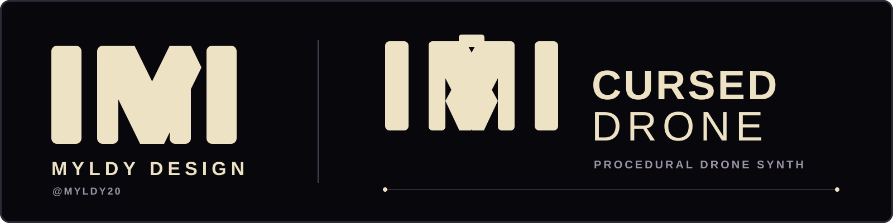

<p align="center"></p>
<p align="center">
<a href="https://github.com/myldy20/cursed-drone/actions/workflows/build.yml"></a>
<a href="https://github.com/myldy20/cursed-drone/actions/workflows/web-pages.yml"></a>
<a href="https://github.com/myldy20/cursed-drone/actions/workflows/web-smoke.yml"></a>


</p>

# Cursed Drone

**Cursed Drone is a handheld and browser-based live soundscape instrument.** It does not merely generate a pure drone: it creates the atmosphere of a place, populated by four procedural actors and evolving events.

> Verified on real **TrimUI Brick** hardware with both **Knulli/PortMaster** and **NextUI**, and on **Pixel 8 Pro** for Android. Packages are platform-specific and not interchangeable. The Android APK remains a public sideload preview.

## Launch, download and install

**[Launch the WebAssembly version](https://myldy20.github.io/cursed-drone/)** · **[Download the latest release](https://github.com/myldy20/cursed-drone/releases/latest)** · [0.14.1 release notes](docs/releases/v0.14.1.md)

- **Web:** open the link above in a modern WebAssembly/Web Audio browser and press the launch button. Mouse, drag gestures and touch are supported;
- **Knulli / PortMaster:** [English](docs/install.en.md) · [Русский](docs/install.ru.md)
- **NextUI:** [English](docs/install.nextui.en.md) · [Русский](docs/install.nextui.ru.md)
- **Android ARM64 public preview:** [English](docs/install.android.en.md) · [Русский](docs/install.android.ru.md)

The browser build stores autosave and the eight memory slots locally in IndexedDB. Audio starts only after an explicit press because browsers block automatic Web Audio playback. Android and Web share the same adaptive fullscreen interface; the controller-first 512×384 UI remains dedicated to TrimUI and desktop SDL builds.

## Guided workflow

`PLACE → ACTOR → FX → MASTER → MEMORY`

- **Place:** ten landscape recipes, five performance macros and four actor levels/mutes.
- **Actor:** landscape engines or the **Musical** source with 16 curated macro models, MAIN/AUX/MIX/STEREO routing and Scala tuning. Event actors can be triggered immediately and have their own Event Rate.
- **FX:** four serial effects per actor, edited in one unified slot view.
- **Master:** level, tempo and four post-mix effects for long tails and transitions.
- **Memory:** autosave plus eight explicit user slots and landscape restore.

Detailed guide: [English](docs/workflow.en.md) · [Русский](docs/workflow.ru.md)

## Features

- four procedural actors and ten places;
- 34 engines, including Sub Drone, Tape Drone, Bowed Metal, Earth Rumble and the **Musical** macro-oscillator source;
- four modulation rows per actor, bipolar depth and bounded rate cross-modulation;
- manual triggering and visible activity flashes for event actors;
- per-actor Event Rate plus the global Events macro;
- Euclidean event generation;
- built-in and user Scala `.scl` tuning;
- 21 effects including Reverse Grains and five compound drone/ambient processors;
- four Actor FX plus four Master FX;
- eight memories, autosave and English/Russian UI;
- controller-first SDL UI at 512×384 for handheld and desktop builds;
- one adaptive fullscreen interface shared by Android and WebAssembly;
- one version file, root CMake graph and CI pipeline for every supported platform;
- no recorded samples.

## Controls on TrimUI / desktop SDL

| Button | Meaning |
| --- | --- |
| D-pad | navigate; edit the selected value; hold to accelerate |
| A | open, confirm, perform the selected action, or mute an actor |
| B | back/cancel; hold for emergency Kill |
| X | next focus section on the current page |
| Y | contextual help |
| L / R | previous / next page |
| Select | fade the final output |
| Start | quick menu |
| Start + Select | save the current state and exit |

## Runtime data

Knulli: `curseddrone/conf/` · NextUI: `.userdata/tg5040/cursed-drone/` · Web: browser IndexedDB · Android: private app storage.

Runtime data includes `autosave.cdrone`, `memory-1.cdrone` … `memory-8.cdrone`, and optional `scales/*.scl` where the platform supports importing files. Sessions are sanitized before use; if a primary file is corrupt, Cursed Drone attempts to recover its previous atomic `.bak` copy.

## Build

```bash
git submodule update --init --recursive
cmake -S . -B build -DCMAKE_BUILD_TYPE=Release
cmake --build build -j2
ctest --test-dir build --output-on-failure
```

WebAssembly:

```bash
emcmake cmake -S . -B build-web -G Ninja -DCMAKE_BUILD_TYPE=Release
cmake --build build-web --target cursed-drone-web --parallel 2
```

CI tests Linux, macOS, Android ARM64, WebAssembly and Ubuntu-20.04-compatible AArch64. Every change builds the desktop/handheld frontends, PortMaster, NextUI, an installable Android preview APK and the static browser bundle from the same core sources. Browser smoke tests cover mouse/touch navigation, drag gestures, DPR 1/2 and a letterboxed Retina viewport. Shipped runtime changes must advance `VERSION` and include matching release notes.

## 0.14.1 hardening and performance baseline

Version 0.14.1 adds central session sanitization, automatic backup recovery, Android lifecycle saves, prompt IndexedDB persistence and control-rate Scala pitch quantization. It also adds browser interaction and version-discipline gates to prevent repeats of the Web/Retina and same-version release regressions.

The 0.13.1 realtime optimisation baseline remains intact: slowly changing event, modal and effect coefficients run at control rate, equal-power pan uses interpolated tables and muted actors are suspended completely. On the reproducible x86 benchmark used during development, the default Derelict scene rendered about 20% faster and the 20× Black Hole stress case about 70% faster than 0.12.3. These figures are comparative desktop measurements; real TrimUI Brick load depends on firmware, clock and selected scene.

Run the benchmark locally with `make benchmark` or `build/cursed-drone-benchmark 5`.

## Documentation

- [Changelog](CHANGELOG.md) · [0.14.1 release notes](docs/releases/v0.14.1.md)
- [Workflow](docs/workflow.en.md) · [Сквозная логика](docs/workflow.ru.md)
- [Architecture](docs/architecture.en.md) · [Архитектура](docs/architecture.ru.md)
- [Synthesis catalogue](docs/synthesis-catalog.en.md) · [Каталог синтеза](docs/synthesis-catalog.ru.md)
- [Effects](docs/effects.en.md) · [Эффекты](docs/effects.ru.md)
- [TrimUI Brick](docs/trimui-brick.en.md) · [TrimUI Brick](docs/trimui-brick.ru.md)
- [Roadmap](docs/roadmap.en.md) · [Дорожная карта](docs/roadmap.ru.md)

## Credits and licence

Developed by **Myldy design — [@myldy20](https://github.com/myldy20)**. First-party code is GPL-3.0-or-later with the narrowly scoped attribution, origin-marking and trademark terms in [ADDITIONAL_TERMS.md](ADDITIONAL_TERMS.md). Modified distributions must preserve [NOTICE.md](NOTICE.md) and identify themselves as based on Cursed Drone and unofficial.

The Musical source compiles selected MIT-licensed DSP from Mutable Instruments Plaits. Copyright and permission notices are retained in [THIRD_PARTY_NOTICES.md](THIRD_PARTY_NOTICES.md) and `third_party/PLAITS_LICENSE.txt`. Cursed Drone is an independent product and is not affiliated with or endorsed by Mutable Instruments or Emilie Gillet.

---

# Русский

**Проклятый гудёж — карманный и браузерный инструмент живых звуковых пространств.** Он не просто выдаёт чистый дрон, а создаёт атмосферу места, населённого четырьмя процедурными актёрами и развивающимися событиями.

> Проверено на реальной **TrimUI Brick** с **Knulli/PortMaster** и **NextUI**, а Android-версия — на **Pixel 8 Pro**. Пакеты для разных платформ не взаимозаменяемы. Android-сборка распространяется как публичная preview-версия для ручной установки.

## Запустить, скачать и установить

**[Запустить веб-версию](https://myldy20.github.io/cursed-drone/)** · **[Скачать актуальный релиз](https://github.com/myldy20/cursed-drone/releases/latest)** · [что нового в 0.14.1](docs/releases/v0.14.1.md)

- **Web:** открыть ссылку выше в современном браузере с WebAssembly/Web Audio и нажать кнопку запуска. Работают мышь, drag-жесты и тач;
- **Knulli / PortMaster:** [русская инструкция](docs/install.ru.md) · [English](docs/install.en.md)
- **NextUI:** [русская инструкция](docs/install.nextui.ru.md) · [English](docs/install.nextui.en.md)
- **Android ARM64 preview:** [русская инструкция](docs/install.android.ru.md) · [English](docs/install.android.en.md)

Веб-версия хранит autosave и восемь слотов памяти локально в IndexedDB браузера. Звук запускается только после явного нажатия: браузеры запрещают автоматический запуск Web Audio. Android и Web используют один адаптивный полноэкранный интерфейс; для TrimUI и desktop SDL остаётся отдельный кнопочный UI 512×384.

## Сквозная логика

`МЕСТО → АКТЁР → FX → МАСТЕР → ПАМЯТЬ`

- **Место:** десять ландшафтов, пять исполнительских макросов, уровни и mute четырёх актёров.
- **Актёр:** движки ландшафта или источник **Музыкальный** с 16 макромоделями, MAIN/AUX/MIX/STEREO и Scala-строями. Событийного актёра можно запустить сразу и отдельно настроить частоту событий.
- **FX:** четыре последовательных эффекта актёра в едином редакторе.
- **Мастер:** уровень, темп и четыре эффекта после сведения.
- **Память:** autosave, восемь явных слотов и восстановление рецепта ландшафта.

Подробно: [сквозной workflow](docs/workflow.ru.md) · [English](docs/workflow.en.md)

## Возможности

- четыре процедурных актёра и десять мест;
- 34 движка, включая саб-дрон, ленточный дрон, смычковый металл, гул земли и источник **Музыкальный**;
- четыре строки модуляции на актёра, биполярная глубина и ограниченная cross-modulation скорости;
- ручной запуск и видимая вспышка событийных актёров;
- отдельная частота событий актёра плюс глобальный макрос «События»;
- Euclidean-события;
- встроенные и пользовательские Scala-файлы `.scl`;
- 21 эффект, включая Reverse Grains и пять составных процессоров;
- четыре Actor FX и четыре Master FX;
- восемь слотов памяти, autosave, русский и английский интерфейс;
- кнопочный SDL-интерфейс 512×384 для приставки и desktop;
- единый адаптивный полноэкранный интерфейс для Android и браузерной WebAssembly-версии;
- единая версия, корневой CMake и CI для всех платформ;
- никаких записанных семплов.

## Данные

Knulli: `curseddrone/conf/` · NextUI: `.userdata/tg5040/cursed-drone/` · Web: IndexedDB браузера · Android: приватные данные приложения.

Там находятся `autosave.cdrone`, `memory-1.cdrone` … `memory-8.cdrone` и пользовательские `scales/*.scl`, если платформа поддерживает импорт файлов. Перед использованием значения сессии проверяются; если основной файл повреждён, приложение пытается восстановить предыдущую атомарную копию `.bak`.

## Лицензия и Plaits

Разработано **Myldy design — [@myldy20](https://github.com/myldy20)**. Собственный код проекта распространяется по GPL-3.0-or-later с узкими дополнительными условиями об атрибуции, обозначении происхождения и брендинге в [ADDITIONAL_TERMS.md](ADDITIONAL_TERMS.md). Производные версии должны сохранять [NOTICE.md](NOTICE.md), указывать основу Cursed Drone и явно обозначаться как неофициальные.

Источник «Музыкальный» использует выбранные части DSP Mutable Instruments Plaits по лицензии MIT. Авторские уведомления и текст лицензии сохранены в [THIRD_PARTY_NOTICES.md](THIRD_PARTY_NOTICES.md) и `third_party/PLAITS_LICENSE.txt`. Cursed Drone — самостоятельный продукт, не связанный с Mutable Instruments и не одобренный Mutable Instruments или Эмили Жилле.
