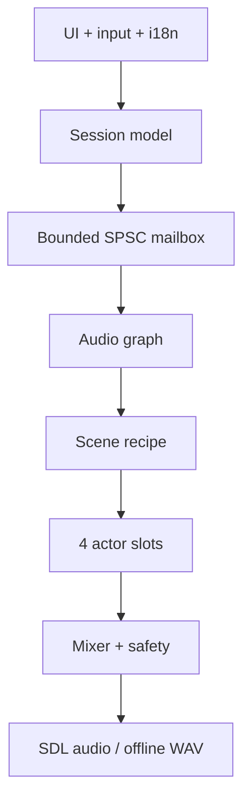

# Architecture

## Goals

1. Sustain four engines and up to sixteen effects on a roughly 1 GHz quad-core ARM.
2. Never block the audio thread on files, mutexes, logging or allocation.
3. Keep the product independent from any single DSP project through narrow adapters.
4. Preserve equivalent behavior on desktop, TrimUI Brick and other SDL2 handhelds.
5. Turn a deliberately small control surface into an expressive instrument through modulation and bounded randomness.

## Layers



`Session` is a trivially-copyable snapshot owned and edited by the UI. `SpscQueue<Session, 8>` transfers complete snapshots from one producer to one consumer and reports overflow. `AudioGraph` owns every DSP runtime object. Once `prepare()` returns, `process()` allocates no memory, takes no locks and throws no exceptions. SDL is only a platform adapter; the core has no SDL dependency.

## Slot graph

Each slot is `engine → FX1 → FX2 → FX3 → FX4 → level/pan`. Four modulation lanes alter smoothed engine, mix or effect parameters before each sample is processed.

In `0.4.0` a scene recipe assigns four different roles and safe starting ranges. Derelict uses room bed/footsteps/door/pipe; Factory uses motor/machine/crowd/metal; Wasteland uses wind/birds/insects/signal. The old `TONE`, `RESONATOR`, `GRAINLET`, and `PARTICLES` remain manually available. Every source follows the same conceptual contract:

```cpp
prepare(sample_rate, max_block_frames)
reset()
process(parameters, output_block)
```

An adapter must allocate ahead of time, map stable product macros to upstream ranges, avoid UI/files/global singletons, declare a rough CPU tier, and pass finite/non-silent smoke tests.

## Parameters and modulation

The stable detailed surface is `frequency`, `timbre`, `color`, `motion`, `texture`, `level`, and `pan`, with actor-specific UI labels for the four character controls. Continuous detailed values use roughly 20 ms one-pole smoothing; master/performance use 80–120 ms. In schema 4 the stored `texture`, `pulse`, `chaos`, `space`, and `events` fields have the product meanings Material, Activity, Tension, Distance and Evolution. The scene and separate fade times are persisted. The loader migrates schema 1–3 to the new safe default landscape.

Current modulators are sine, triangle, sample-and-hold and bounded random walk. Scene actors additionally own event schedulers for short gestures, heel/toe and impact/exhaust pairs, clusters, approach cycles and rising sequences followed by bounded-random pauses. Tempo scales repeating processes without introducing tracker transport. Deterministic PRNG streams are separate per actor, and directed contours are not approximated by random LFOs.

## FX, memory and safety

Every FX cell currently preallocates a 1.3 second stereo delay line. Sixteen cells consume about 8 MB at 48 kHz, but algorithm changes never allocate in the callback. A later shared fixed pool may reduce that footprint.

After summing the four slots, master smoothing feeds a DC blocker and a `tanh` soft limiter whose output remains inside `[-1, 1]`. The current atomic Kill request clears sources, delay memory, DC state and telemetry at the next block boundary. A later revision will surround that hard reset with a short click-free fade.

| Thread | Allowed | Forbidden |
| --- | --- | --- |
| audio callback | bounded queue reads, DSP, atomics | allocation, files, mutexes, stdout, sleep |
| UI/main | input, drawing, Session edits and saving | direct mutation of DSP runtime |
| background (later) | loading into staging buffers | writes to active audio buffers |

The logical UI is `512×384`, scaling exactly to the Brick's `1024×768`; wider screens use letterboxing. A vendored 512-glyph bitmap font supplies in-window Russian and English without SDL_ttf. Missing typographic punctuation and arrows use readable ASCII fallbacks instead of `?`. The audio thread publishes per-slot/master RMS, peak, and 64-point captured waveforms through atomics. The SDL callback measures processing time as a fraction of the available block and displays it as DSP load. The UI writes debounced schema 4 autosaves under `SDL_GetPrefPath`.
