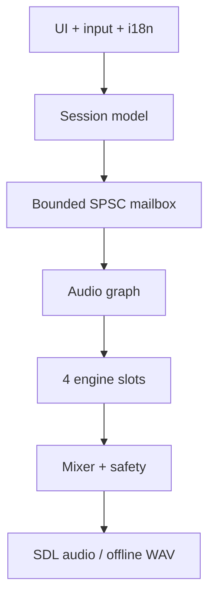

# Architecture

## Goals

1. Sustain four engines and up to sixteen effects on a roughly 1 GHz quad-core ARM.
2. Never block the audio thread on files, mutexes, logging or allocation.
3. Keep the product independent from any single DSP project through narrow adapters.
4. Preserve equivalent behavior on desktop, TrimUI Brick and other SDL2 handhelds.
5. Turn a deliberately small control surface into an expressive instrument through modulation and bounded randomness.

## Layers



`Session` is a trivially-copyable snapshot owned and edited by the UI. `SpscQueue<Session, 8>` transfers complete snapshots from one producer to one consumer and reports overflow. `AudioGraph` owns every DSP runtime object. Once `prepare()` returns, `process()` allocates no memory, takes no locks and throws no exceptions. SDL is only a platform adapter; the core has no SDL dependency.

## Slot graph

Each slot is `engine → FX1 → FX2 → FX3 → FX4 → level/pan`. Four modulation lanes alter smoothed engine, mix or effect parameters before each sample is processed.

The `0.1.0` diagnostic engine validates this route; it is not intended to replace any upstream product engine. Each future adapter follows the same conceptual contract:

```cpp
prepare(sample_rate, max_block_frames)
reset()
process(parameters, output_block)
```

An adapter must allocate ahead of time, map stable product macros to upstream ranges, avoid UI/files/global singletons, declare a rough CPU tier, and pass finite/non-silent smoke tests.

## Parameters and modulation

The stable macro surface is `frequency`, `timbre`, `color`, `motion`, `texture`, `level`, and `pan`. Continuous values use roughly 20 ms one-pole smoothing; master uses 30 ms. Switches and algorithms change at block boundaries.

Current sources are sine, triangle, sample-and-hold and bounded random walk. Destinations are pitch, the five engine macros, level, pan, and every FX amount. Pitch is exponential; other routes are additive and clamped. Planned clock-aware sources include follower, Brownian and logistic chaos, Euclidean pulses, probability bursts and short step curves—without introducing a tracker grid.

## FX, memory and safety

Every FX cell currently preallocates a 1.3 second stereo delay line. Sixteen cells consume about 8 MB at 48 kHz, but algorithm changes never allocate in the callback. A later shared fixed pool may reduce that footprint.

After summing the four slots, master smoothing feeds a DC blocker and a `tanh` soft limiter whose output remains inside `[-1, 1]`. A future always-available Panic action will fade, clear runaway feedback/freeze states, and restore safe output.

| Thread | Allowed | Forbidden |
| --- | --- | --- |
| audio callback | bounded queue reads, DSP, atomics | allocation, files, mutexes, stdout, sleep |
| UI/main | input, drawing, Session edits and saving | direct mutation of DSP runtime |
| background (later) | loading into staging buffers | writes to active audio buffers |

The logical UI is `512×384`, scaling exactly to the Brick's `1024×768`; wider screens use letterboxing.
