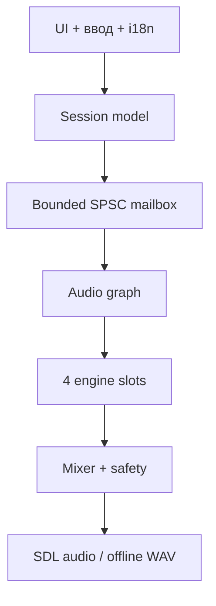

# Архитектура

## Цели

1. Стабильно держать четыре движка и до шестнадцати FX на четырёхъядерном ARM с частотой около 1 ГГц.
2. Никогда не блокировать аудиопоток файловой системой, mutex, логированием или выделением памяти.
3. Отделить продукт от конкретного DSP-проекта: каждый внешний движок подключается узким адаптером.
4. Сохранить одинаковое поведение на desktop, TrimUI Brick и других SDL2-устройствах.
5. Сделать ограниченный интерфейс выразительным за счёт модуляций и управляемой случайности.

## Слои



- `Session` — trivially-copyable снимок всех пользовательских настроек. UI владеет редактируемой копией.
- `SpscQueue<Session, 8>` — единственный путь обновления параметров между одним producer и одним consumer. Переполнение явно возвращает `false`.
- `AudioGraph` — владелец всего runtime-состояния DSP. После `prepare()` его `process()` не аллоцирует память и не бросает исключения.
- `SDL` — только один из адаптеров платформы. Ядро не включает SDL-заголовки.

## Один слот


В `0.2.0` диагностический источник имеет четыре намеренно разных тестовых характера: основной drone, pulse-wave, FM и noise/particle. Это позволяет проверить управление, но не является попыткой заменить Plaits, Elements, Rings, Clouds или DaisySP. Продуктовые движки должны реализовать одинаковый контракт:

```cpp
prepare(sample_rate, max_block_frames)
reset()
process(parameters, output_block)
```

Адаптер обязан:

- заранее выделить всю память;
- перевести нормализованные ручки продукта в диапазоны upstream DSP;
- не обращаться к UI, файлам и глобальным singleton;
- объявить приблизительную CPU-категорию `light`, `medium` или `heavy`;
- иметь golden/smoke test на конечный и ненулевой выход.

## Параметры

Пользователь видит небольшой стабильный набор макроручек: `frequency`, `timbre`, `color`, `motion`, `texture`, `level`, `pan`. Конкретный адаптер может скрывать неприменимые ручки и переименовывать подписи через i18n, но не должен менять физическую навигацию.

Все непрерывные параметры сглаживаются однополюсным фильтром примерно за 20 мс; master/performance — за 80–120 мс. Переключатели и типы эффектов меняются на границе блока.

Над детальными настройками лежит недеструктивный `PerformanceSettings`: `texture`, `pulse`, `chaos`, `space`, `fade`. Они хранятся отдельно в schema 2 и вычисляются внутри callback поверх базовых значений. Возврат макроручки назад восстанавливает исходный детальный патч. Loader принимает schema 1 и заполняет новые поля безопасными значениями по умолчанию.

## Модуляция

Каждый слот имеет четыре lane. Текущие источники:

- sine;
- triangle;
- sample & hold;
- bounded random walk.

Назначения: pitch, пять макропараметров, level, pan и amount каждой FX-ячейки. Источник выдаёт диапазон `[-1, 1]`, затем применяются depth и offset. Pitch использует экспоненциальное масштабирование; остальные назначения — аддитивное с последующим clamp.

`Pulse` уже создаёт нелинейную BPM-синхронную огибающую с ростом внутреннего ratio. `Chaos` обновляет случайные цели с частотой, зависящей от макроса, и сглаживает их перед влиянием на pitch/level/pan/texture. Следующие источники: envelope follower, Brownian motion, logistic chaos, Euclidean pulse, probability burst и короткая step curve.

## FX и память

Каждая FX-ячейка заранее резервирует delay-buffer до 1,3 секунды, поэтому смена типа эффекта не вызывает allocation в callback. Для 16 ячеек при 48 kHz это около 8 МБ. После внедрения CPU/memory budget возможна оптимизация через фиксированный pool общих delay-линий.

Текущие эффекты — инфраструктурные реализации. Они позволят проверить маршрутизацию до импорта внешних алгоритмов. Плановые классы стоимости:

| Класс | Примеры | Поведение UI |
| --- | --- | --- |
| light | filter, drive, fold, crusher, ring mod | без ограничений |
| medium | chorus, phaser, delay, diffusion/reverb | показывать суммарную нагрузку |
| heavy | granular freeze, pitch, spectral smear/stretch | предупреждение и Eco-вариант |

## Выходная безопасность

После суммирования четырёх слотов стоят:

1. master gain со сглаживанием;
2. DC blocker `y[n] = x[n] - x[n-1] + 0.995 y[n-1]`;
3. мягкий `tanh` limiter с выходом строго внутри `[-1, 1]`.

`KILL` уже передаётся отдельным atomic-флагом и на границе следующего блока сбрасывает источники, delay-memory, DC state и telemetry. Сейчас это жёсткое обнуление; следующий вариант добавит короткий click-free fade и безопасное восстановление.

## Потоки

| Поток | Разрешено | Запрещено |
| --- | --- | --- |
| audio callback | bounded queue read, DSP, atomics | malloc/free, filesystem, mutex, stdout, sleep |
| UI/main | ввод, render, редактирование Session, сохранение | прямое изменение runtime DSP |
| background (позже) | чтение sample/preset в staging buffer | запись в активные audio buffers |

## Рендер и разрешение

Логическое разрешение — `512×384`. На Brick оно масштабируется ровно в 2 раза до `1024×768`; на широких дисплеях используется letterbox. UI использует встроенный 512-glyph bitmap-шрифт с явным UTF-8→glyph mapping для ASCII и русского алфавита. Аудиопоток публикует RMS/peak по каждому слоту и master через atomics; UI читает только telemetry snapshot, не касаясь DSP runtime.
